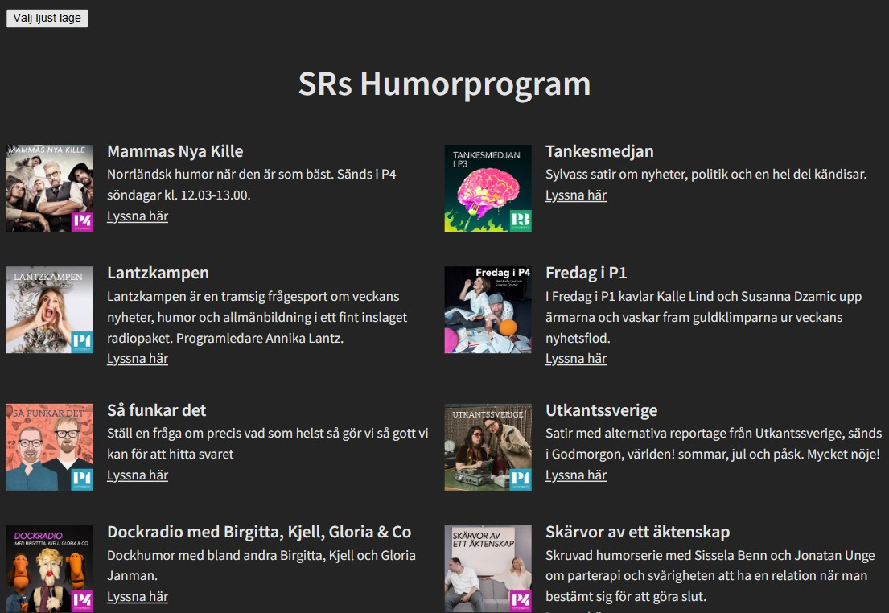

[](https://classroom.github.com/online_ide?assignment_repo_id=10475269&assignment_repo_type=AssignmentRepo)

## Description

This is my first assignment in the course "Working methodology for developers". The goal with this project is to learn how to convert a badly written and structured code into a good code with certain standards. We were given css and javascript files and a project that didn't work properly. Down below you can see different todos that needed to be fixed. We were to convert the css to scss, javascript to typescript and restructure, remove and rewrite the code if needed to achieve best practice standards.




### How does the code work?

This code is fetching podcasts from Sr (Sveriges radio) and create html to show the user what was fetched with an image, title, description and a link to be able to listen to the podcast audio. The user should also be able to switch between light and dark color mode.

- init() - This startup function adds eventListener with "click" event to the darkmode toggle button and calls the createHtml function.
- createHtml() - this function calls the getPodcasts function and gets an array of IPodcast objects back. It uses the objects as a parameter for other functions that create html and call for these functions.
- getPodcasts() - try to fetch podcasts from SR's api. If succeeded, an array of objects (of interface IPodcast) will be returned.
- createPodcastDiv() - creates a div that will be each podcast's container, and then return the element.
- createImg() - creates an image element that show each podcast's image.
- createTextDiv() - creates a div for each podcast to contain the title, description and link.
- createHeader() - creates a heading element for the podcast title.
- createParagraph() - creates a paragraph for the description.
- createLink() - creates an anchor element and sets the source attribute with the right link.

### Programs and installations

Note! Don't forget to run "npm i" to install all packages that is needed.

```bash
npm i
```

I use:

- Axios
- ESLint
- dotenv
  [](https://parceljs.org/getting-started/webapp/)
- Typescript
- @types/node
- Stylelint for scss

### Start-up

Before you run this project:

- Add your own .env-file
- Create a variable with name "API_LINK" in the .env-file (For example, see .env.example)
- Run parcel with command "npm run parcel". See the other scripts I have added in the package.json file.

.env

```bash
API_LINK = "something.se/.../..."
```

```bash
npm run parcel
```

## Todos

G

- [x] Få projektet att funka
- [x] CSS till Sass
- [x] Enhetlig namngivning i CSS:en
- [x] Konvertera till TypeScript
- [x] Enhetlig kodkvalitet
- [x] Mobilvyn
- [x] Språk
- [x] Rensa loggning
- [x] Dokumentation
- [x] Tillgänglighet (bilder)
- [x] Refaktorera funktioner
- [x] ?Eliminera onödig kod
- [x] Rensa bort kod som inte ska sättas

VG

- [x] Rätt sak på rätt plats
- [ ] Hantera loggning på ett effektivt sätt
- [ ] Gör en tillgänglighetsgranskning av sidan
- [ ] Utnyttja features i Sass i CSS:en
- [ ] Rensa bort paket som inte används
- [ ] Hantera fel i API-anropet
- [ ] Gör en Lighthouse-analys
- [ ] Läs av utvecklingsmiljön
- [x] Enhetlig syntax i CSS:en
- [ ] Publicera sidan på GitHub pages
